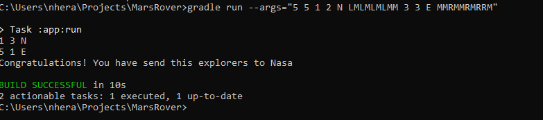

# Mar Rovers version 1

This is the first version that has helped me to understand the domain.

The goal is to send rovers to the planet Mars. 


# 1. About this solution

This solution translates the domain of the letters to the trigonometric domain. 
This way, doing calculations is easier.

Also, in cases we can use different letters, the logic in the code is unaffected and follows the principle of **"Open to extension, close to modification "**

For example, a "Position" is a class that store the coordinates x and y and instead of a letter for the orientation, the Rover position stores the the angle the position represents.

Also, the cardinal points are translated from letters to angle and coordinates.

The commands are stored in a map, this way, adding new commands doesn't affect the logic, we have only to add the new command and how is applied to the rover.

The Area object is powerful, because is using predictates and we are not limited to rectangular shapes. Only to shapes that can contains integers.
Getting an area that is a circle or a triangle could be done if we modify  the Position class to use floating point numbers instead of integers.

Thanks to all the above, this solution is easy extensible to other domains appart of a square grid.

The solution can send more than two rovers.


# 2. How to try the code

Please, firstly clone the repository
```
https://github.com/nherac/MarsRover.git
```

You can run the currents tests or try your own custom inputs.
  
## 2.a ) Running current tests.
### From the command line
```
gradle test
```
And this is the result:


### From IntelliJ

You can also run the test from IntelliJ. Please, the "show passed" botton should be selected


## 2.b ) Running the program using your own inputs

To customize your the inputs. For example, if you want to run this input:
    
  * Grid -> 5 5
  * Rover 1 starting point -> 1 2 N
  * Rover 1 commands -> LMLMLMLMM
  * Rover 2 starting point ->3 3 E
  * Rover 2 commands -> MMRMMRMRRM 
    
Please, format the arguments in the following way:
To try your own inputs from the command line, run them this way:

```
gradle run --args="5 5 1 2 N LMLMLMLMM 3 3 E MMRMMRMRRM"
```

In the console, you will see the following:



    
This solution runs the input introduced and check that it could be performed without throwing exception.
If an illegal argument exception in the arguments is thrown, then, the system tell you:
"Oh, you need to fix your input and the rovers won't be launched to Mars"
For example, if a rover will bump with another rover, the simulator warns you.

```
C:\Users\nhera\Projects\MarsRover>gradle run --args="5 5 1 2 N LMLMLMLMM 1 2 N LMLMLMLMM"
```


```
Task :app:run FAILED
Exception in thread "main" java.lang.IllegalArgumentException: Oh, the input in the simulation was caused because This coordinate is busy, the rover cannot go here .Please, you can fix the input and don't worry, it wasn't the real Explorer
at marsrover.UserInterface.main(UserInterface.java:17)

FAILURE: Build failed with an exception.

If your input is invalid, the system will throw an exception and tell you the reason.
```


As you can read above, there is a message saying that the input in the simulation was cause because the coordinate was busy.


# 3. Caveats
## 3.a) Happy path. Expected use case.
The happy path for this exercise happens when a user introduces a valid input.
This exercise is customized to this input:
* Grid
Refers to a square grid, the first two arguments should be positive integers
* The rover info is a combination of:
  
    * Position: 
Coordinates and orientation should be inside the grid. 
If there are more rovers in the grid, then this position should be available.
    * Commands:
The rover can understand the commands L,R,M.
The introduced commands should allow the rover to move inside the grid and withoud collided with other rovers.
## 3.b) Invalid input. Unexpected use cases.

The invalid inputs in this system are the following:

If there is another kind of exception apart of the above, then, we need to look at the logic. 


# 4. Journey solving the exercise
## 4.1) Hand tracing analysis
More detail in this link
[Hand Tracing solution](/Handtracing.md)

## 4.2) Coding

Trying to use test driven development, but being honest, there were moments where I was coding more implementation code than tests.
I can call it the "GREEN RED GREEN"  but with this meaning:

* Green -> trying to write tests firsts...and later the implementation
* Red-> Throwing caution to the wind and write implementation without tests
* Green -> going back to TDD and writing tests.

I have been coding using the lasted java version (Java 16), but being fair, the code could be done doing Java 8. I need to investigate how to apply the module system that Java 9 offers.


## 4.3) What I learnt

That an apparently easy exercise requires a lot of time and the Mars rovers wasn't as easy as it looks like.
But I have enjoyed the journey a lot.


