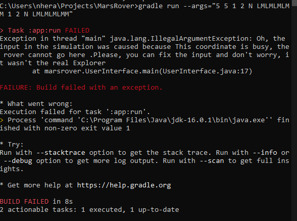

# Mar Rovers version 1

This is the first version that has helped me to understand the domain.

The goal is to send rovers to the planet Mars. 


# 1. About this solution


The solution uses:

* Plain java objects (pojos) that doesn't contain any logic, apart getter/setter. They are Area, Coordinates, Position, Rover
* Enum types to check the String in the input is the expected. They are Commands and Cardinal
* Classes that contain logic to perform the operations. They are the parent class Explorer and the subclass(child) ExplorerNasa. The UserInterface uses ExplorerNasa.
* Also uses the lasted Java version (Java 16 today) and the Unit framework Jupiter.

The pojo **Area** contains two predicates that inform what it is the domain for x values and for y values. Adding a third dimension, like "z" would need to add another Predicate. This way, the area can be customized to any kind of rectangular shape or shapes that contains integers numbers. In case we want to use circumferences or other shapes, we would need to update the Coordinates pojo to use floating point numbers (double) instead of integers.

The pojo **Coordinates** contains two integers to represent the x and the y.

The pojo **Position** has the pojo "Coordinates" and an integer to represent the angle. This way, we translate from the letters domain to the numerical domain, and to make the future logic of the code, we only need to apply trigonometry math formulas. This way:

|Cardinal Letter| Angle|In case we position is increment forward,how coordinates should increment|
|---------------|------|-------------------------------------------------------------------------|
|N|90| (0,1)|
|E|180|(-1,0)|
|S|270|(0,-1)|
|W|0|(1,0)|

The enumerated type **Cardinal** stores the info about the cardinal letter, to validate that the introduced position is allowed, in case we introduce an incorrect letter for position, it will throw an exception.
As the Area type, if we use floating point numbers instead of integers, we could use other cardinal position like North-East that mean the angle is 45 degrees and cause floating point results.

The enumerated type **Commands** stores the info about the available commands. Then, if a command that is not supported is passed as an input, it will throw an exception. Current valid commands are L,R,M.

The pojo **Rover** has a Position field and a list of Commands that should be applied on it. 

Logic about how to apply the commands in the Rover is in the Explorer class, that contains a map specifies how  to apply each commands.
The logic is contained in this abstract class, Explorer, that gets each single rover and apply the list the commands on them depending on the map.
Increasing the commands that can be used only require to create a new element in the map, and the rest of the logic won't need any modification, then, this is following the "Open to extension, close to modification".

The class **ExplorerNasa** is a child of Explorer and its only function is to parse the input and create an Explorer for that input. Using another kind of input requires to extend the Explorer class as we have done with ExplorerNasa. 
Currently, this ExplorerNasa is expecting a grid and the lower left coordinates are (0,0). Also, a list of rovers. The solution expects 1 rover or more and throw an exception if there are not enough information to build one grid and one rover.

The **UserInterface** class only missions are:
* to check that the input from the user can create a proper ExplorerNasa
* That the explorer's input allows the rovers to explorer without having issues like going out of the Plateau or bump with eachother
If the input causes issues in the mission, then, the UserInterface warns the users throwing an exception. If the input produces the happy path that the rovers can explorer without issue, then the real NasaExplorer is created and launched.


# 2. How to try the code

Please, firstly clone the repository
```
https://github.com/nherac/MarsRover.git
```

You can run the currents tests or try your own custom inputs.
  
## 2.a ) Running current tests.
### From the command line
```
gradle test
```
And this is the result:


### From IntelliJ

You can also run the test from IntelliJ. Please, the "show passed" botton should be selected


## 2.b ) Running the program using your own inputs

To customize your the inputs. For example, if you want to run this input:
    
  * Grid -> 5 5
  * Rover 1 starting point -> 1 2 N
  * Rover 1 commands -> LMLMLMLMM
  * Rover 2 starting point ->3 3 E
  * Rover 2 commands -> MMRMMRMRRM 
    
Please, format the arguments in the following way:
To try your own inputs from the command line, run them this way:

```
gradle run --args="5 5 1 2 N LMLMLMLMM 3 3 E MMRMMRMRRM"
```

In the console, you will see the following:


    
This solution runs the input introduced and check that it could be performed without throwing exception.
If an illegal argument exception in the arguments is thrown, then, the system tell you:
"Oh, you need to fix your input and the rovers won't be launched to Mars"
For example, if a rover will bump with another rover, the simulator warns you.

```
C:\Users\nhera\Projects\MarsRover>gradle run --args="5 5 1 2 N LMLMLMLMM 1 2 N LMLMLMLMM"
```



```
Task :app:run FAILED
Exception in thread "main" java.lang.IllegalArgumentException: Oh, the input in the simulation was caused because This coordinate is busy, the rover cannot go here .Please, you can fix the input and don't worry, it wasn't the real Explorer
at marsrover.UserInterface.main(UserInterface.java:17)

FAILURE: Build failed with an exception.

If your input is invalid, the system will throw an exception and tell you the reason.
```


As you can read above, there is a message saying that the input in the simulation was cause because the coordinate was busy.

## 2.c) Report generated by IntelliJ

You can read it in the following link:

https://github.com/nherac/MarsRover/blob/main/TestReport.pdf

# 3. Caveats
## 3.a) Happy path. Expected use case.
The happy path for this exercise happens when a user introduces a valid input.
This exercise is customized to this input:
* Grid
Refers to a square grid, the first two arguments should be positive integers
* The rover info is a combination of:
  
    * Position: 
Coordinates and orientation should be inside the grid. 
If there are more rovers in the grid, then this position should be available.
    * Commands:
The rover can understand the commands L,R,M.
The introduced commands should allow the rover to move inside the grid and withoud collided with other rovers.
## 3.b) Invalid input. Unexpected use cases.

The invalid inputs in this system are the following:
// Pending to write all the exeptions

If there is another kind of exception apart of the above, then, we need to look at the logic. 


# 4. Journey solving the exercise
## 4.1) Hand tracing analysis
More detail in this link
[Hand Tracing solution](/Handtracing.md)

## 4.2) Coding

Trying to use test driven development, but being honest, there were moments where I was coding more implementation code than tests.
I can call it the "GREEN RED GREEN"  but with this meaning:

* Green -> trying to write tests firsts...and later the implementation
* Red-> Throwing caution to the wind and write implementation without tests
* Green -> going back to TDD and writing tests.

I have been coding using the lasted java version (Java 16), but being fair, the code could be done doing Java 8. I need to investigate how to apply the module system that Java 9 offers.
Nevertheless, using the last version has allowed me to try the new switch expresions that came in Java 14.


## 4.3) What I learnt

That an apparently easy exercise requires a lot of time and the Mars rovers wasn't as easy as it looks like.
But I have enjoyed the journey a lot.

# 5. What I couldn't do for version 1

* Translate this code to Javascript and Python
* The code in ExplorerNasa.getInstance() to parse the input and create the Explorer is very long. I need to clean it.
* Improve documentation, write all the exceptions the system throws.
* Swap from using integer in Coordinates to use floating point number, this way, we could use more kind of shapes like circumferences or triangles.
* The code is using "functional programming" over mutable objects, and it is not a secure practise. We need to rethink how to code it
* It is not working for parallel programming
* To validate the inputs, we are creating the object ExplorerNasa twice. We should think in an algorithm to validate inputs without running the full system
* Using a logging system instead of "System.out.println"
* Creating a  docker image instead of using gradle directly


